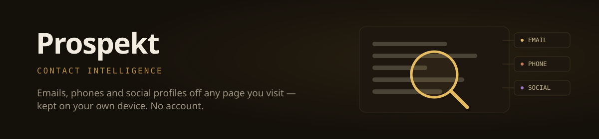

<p align="center">
  
</p>

<p align="center">
  <a href="https://ursacode.github.io/prospekt/"><b>See it &rarr;</b></a> &nbsp;·&nbsp;
  <a href="https://ursacode.com">UrsaCode</a> &nbsp;·&nbsp;
  <a href="https://github.com/UrsaCode/prospekt/actions/workflows/ci.yml"></a>
  
  
  <a href="LICENSE"></a>
</p>

---

**Contact intelligence that never leaves your browser.** Prospekt reads the pages
you visit and keeps the emails, phone numbers, social profiles and anything else
you write a pattern for — on your own machine, with no account, no server and no
network calls.

A local alternative to Hunter.io, Snov.io and similar prospecting tools. Free and
open source; a [Chrome extension](https://ursacode.github.io/prospekt/) built and
maintained by [UrsaCode](https://ursacode.com).

## What it does

Browse normally. Prospekt scans each page as it loads, keeps what matches your
patterns, and gets out of the way. Everything it finds is yours to search,
filter and export.

**Popup** — what's on the page you're looking at right now: what's new, what you
already had, and where each value came from. Copy the new ones, export the page,
or skip the domain.

**Dashboard** — five pages over the whole library:

| Page | What it's for |
|---|---|
| Overview | Totals, hit rate, richest domains, latest finds, and what needs attention |
| Contacts | Every finding, filterable by type, export state, role addresses and duplicates |
| Scan history | Every domain seen, with yield rate and the pages that actually produced |
| Insights | Weekly intake, and whether each of your patterns is earning its place |
| Settings | Every regex and filter list, with a live tester |

### The pattern tester

Settings → any pattern → **Test**. It highlights matches in editable sample text
as you type, and shows what extraction will actually **keep** — not just what the
regex matched. The phone validator runs there too, so date-shaped false positives
are struck out and counted separately:

```
4 matches · 2 kept, 2 discarded by validation
```

A tester that overstates is worse than none, so it tells you the truth before you
save a pattern rather than after it has polluted the library.

## Install

```bash
git clone https://github.com/UrsaCode/prospekt.git
cd prospekt
node build.js
```

Then in Chrome:

1. Open `chrome://extensions`
2. Enable **Developer mode**
3. **Load unpacked** → select `dist/prospekt`

Chrome cannot install the generated `.zip` directly — unzip it and load the
folder. After reloading the extension, refresh any tabs that were already open;
Prospekt can't read a page whose content script predates the reload.

## Privacy

This is the whole point, so it is worth being precise.

- **No network calls at all.** No webfonts, no favicon services, no analytics, no
  telemetry, no update pings. The build refuses to package if any HTML or CSS
  references a remote resource.
- **No account, no server.** Nothing is uploaded, because there is nowhere to
  upload it to.
- **Data lives in `chrome.storage.local`**, in your browser profile, and is
  deleted with the extension.
- **Remote favicons are off by default.** Fetching them would tell every site in
  your library that you were looking at it. Domains render as generated
  monograms instead. You can opt in under Settings → Scanning.
- **Permissions:** `storage`, `tabs`, `contextMenus`, and host access to read
  page content. No `downloads`, no `webRequest`, no `<all_urls>` fetching.

### Where it is honest about its limits

`chrome.storage.local` is readable by content scripts by design — that is how the
content script gets its patterns. A compromised content script could therefore
read the library directly, without going through the extension's message router
(which is otherwise locked down; see `background.js`). Putting contacts beyond
that reach would mean moving them to extension-origin IndexedDB. That is a real
option, not a thing already done.

## Development

No dependencies and no build tooling — plain files that Chrome loads directly.

```bash
npm test          # 317 assertions across two suites
npm run preview   # dashboard in a normal browser tab, with sample data
npm run build     # validate + stage into dist/ + zip
npm run icons     # regenerate PNG icons from tools/icon.svg
```

`npm run build` validates before packaging: manifest shape, that every
referenced file exists, that all JS parses, that `importScripts` resolves, and
that nothing pulls a remote resource.

See [CONTRIBUTING.md](CONTRIBUTING.md) for how the tests work and — more
usefully — what they cannot tell you.

## Layout

```
manifest.json        Manifest V3
defaults.js          Shared defaults: patterns, filter lists, validation
                     (loaded by all three contexts so they cannot drift)
background.js        Service worker: storage, scan orchestration, exports
content.js           Extraction engine, runs on every page
popup.html/.js       Per-page results
dashboard.*          The five-page SPA
build.js             Validate, stage, zip
tests/               Test suites (npm test)
tools/               Icon generation and the dashboard preview server
```

## License

MIT — see [LICENSE](LICENSE).
